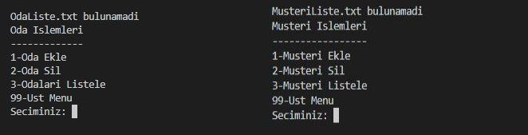
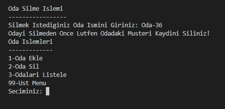
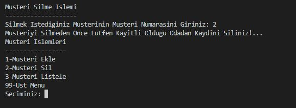
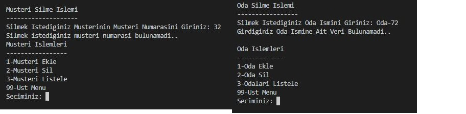
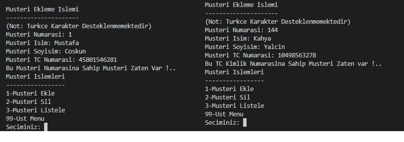

# Otel_Kayit_Sistemi
Mingw derleyicisinde C++ kullanılarak geliştirilmiştir.

## Sınıflar ve Kullanım Amaçları

##### Menu Sınıfı:
* Programın genel olarak işlem menüleri arasında dolaşmaya yarayan kodlar tanımlanmıştır.
* Oda işlemleri menüsü, müşteri işlemleri menüsü ve oda kayıt işlemleri menüsü fonksiyonları bulunmaktadır.
    Ayrıca yönet fonksiyonu ile menüler arasında dolaşım yapılabilmektedir. Yönet fonksiyonu ana menü olarak değerlendirilmiştir.
* Bu sınıf main fonksiyondan herhangi bir bilgi almadığından kurucu ve yıkıcı fonksiyonu tanımlanmamıştır.
* Menü fonksiyonları, daha okunabilir ve güzel görünüm olması için diğer sınıfların nesneleri parametre olarak verilmiştir.

##### Oda İşlem Sınıfı:
* Bu sınıf içerisinde oda ekleme, silme ve listeleme fonksiyonları yer almaktadır.
* Fonksiyonlar parametre olarak oda işlem sınıfının nesnesini almaktadırlar.

##### Müşteri İşlem Sınıfı:
* Bu sınıf içerisinde müşteri ekleme, silme ve listeleme fonksiyonları yer almaktadır.
* Yine aynı şekilde fonksiyonlar müşteri sınıfının main fonksiyonu içerisinde oluşturulan nesnesini
    parametre olarak almaktadırlar.

##### Oda Kayit İşlem Sınıfı:
* Bu sınıf içerisinde odaya müşteri atama ve odadan müşteri kaydı silme fonksiyonları yer almaktadır.
* Parametre olarak oda kayit islem nesnesini almaktadır.

## Farklı Girdilere Karşı Programın Verdiği Mesajlar
- Müşteri veya Oda kayıtlarının tutulduğu dosya yoksa kullanıcıya gerekli dosyanın olmadığı uyarısı gösterilir.
    
- Oda silme işleminde eğer silinmek istenen odada müşteri kaydı varsa hata mesajı vermektedir.
    
- Müşteri silme işleminde eğer silinmek istenen müşterinin herhangi bir odada kaydı bulunuyorsa hata mesajı verilir.
    
- Oda ve müşteri silme işleminde eğer silinmek istenen oda veya müşteri numarası yoksa böyle bir numaranın bulunmadığı uyarı olarak gösterilir.
    
- Müşteri ekleme işleminde eğer eklenmek istenen müşterinin müşteri numarası veya tc kimlik numarası daha önce kaydedilmiş bir müşterininki ile aynı ise hata mesajı gösterilmektedir.
    